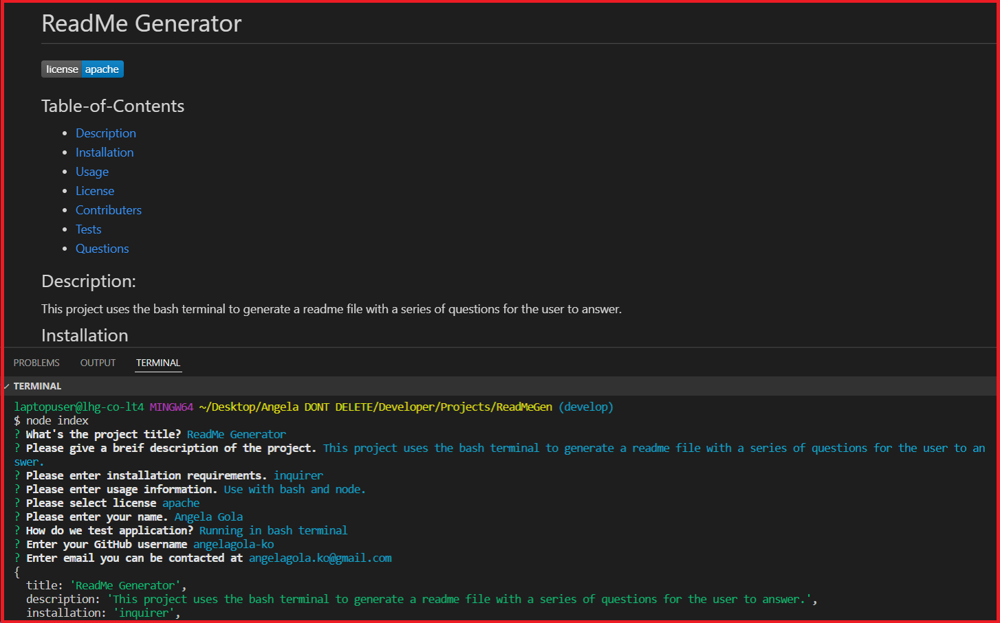

  # ReadMe Generator

  

## Table-of-Contents

  * [Description](#description)
  * [Installation](#installation)
  * [Usage](#usage)
  * [License](#license)
  * [Contributers](#contributers)
  * [Tests](#tests)
  * [Questions](#questions)
  

  ## Description:

  #### fndfkdnaskdasndkasdasdkandaskdn lorm ipaum

  ## Installation 

  #### Inquirer

  ## Usage

  #### sdasd

  

  
  ## License
    
  The application is covered under the following license:
    
  
  
    

  ## Contributers

  #### sdsdasd

  ## Tests

  #### asdasd

  ## Questions

  Please contact me using the following links:
  

  [GitHub](http://github.com/asdasd)

  [Email: zxczc](mailto:zxczc)

  